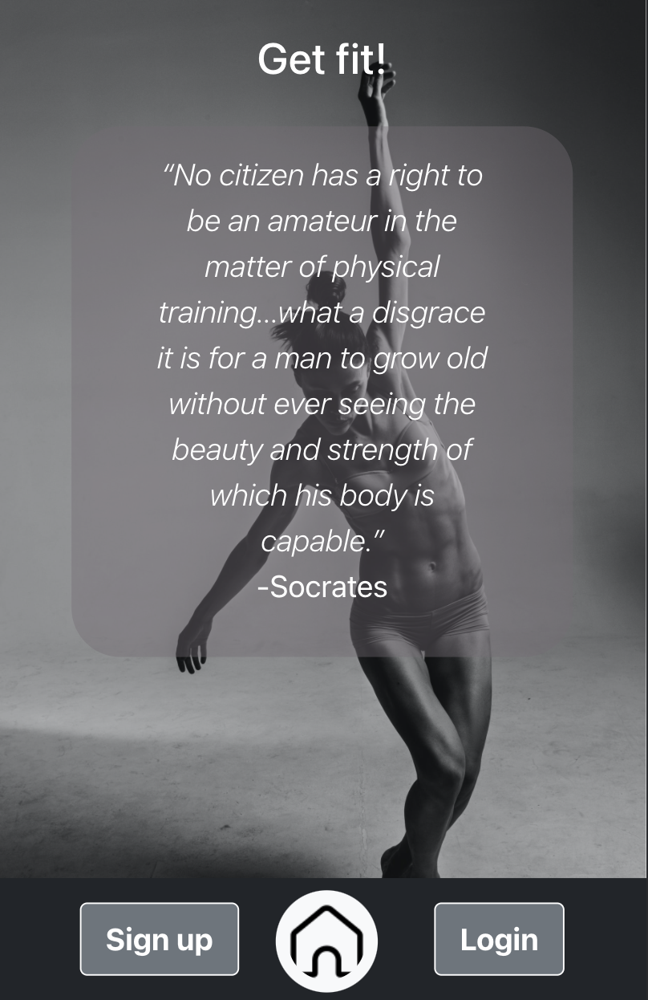
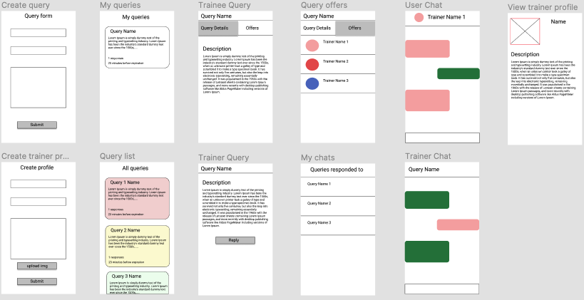
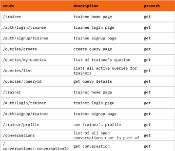

# GET FIT! (Ironhack-project-3)

This app is for all the heroes out there... the teachers, the plumbers, the women, the men, the engineers... But don't just be a hero... Look like one!

Post your fitness needs anonymously, and receive offers from the personal trainers on the platform. Connect and start training!!!

Try all that and more on https://get-fit-app.netlify.app.

## Motivation

This project was done as part of the Ironhack full time web development bootcamp. It is the third and last out of three main projects required to finish the bootcamp. The reason for choosing this theme, is because fitness should be part of everyone's life. This app helps everyone find the right personal trainer to help them achieve their fitness goals.

## Wireframing

The project was started by creating wireframes to draw out the concept, as well as define the UI. There was more than one phase of design where we came back and edited the concept. Below you can see some of the sketches:

## React routes table

## Build status

The website hasn't undergone a lot of testing so it might contain some bugs. User experience has room for improvement.

## Frameworks, libraries and technologies used

- Built using React, with the help of bootstrap
- Bcrypt to support with authentication
- Cloudinary to host the recipe images
- Database: MongoDB for local testing, and Mongo Atlas for production
- Git for distributed version control, and GitHub for source code management and hosting
- Netlify for hosting the frontend of the application

## Special thanks

Thanks to [Raymond](https://github.com/RaymondMaroun) and [Joana](https://github.com/jofariaironhack) for their guidance and support throughout the bootcamp and this project.

## Created by
[Mohammed Chakmakchi](https://github.com/MohammedCh).